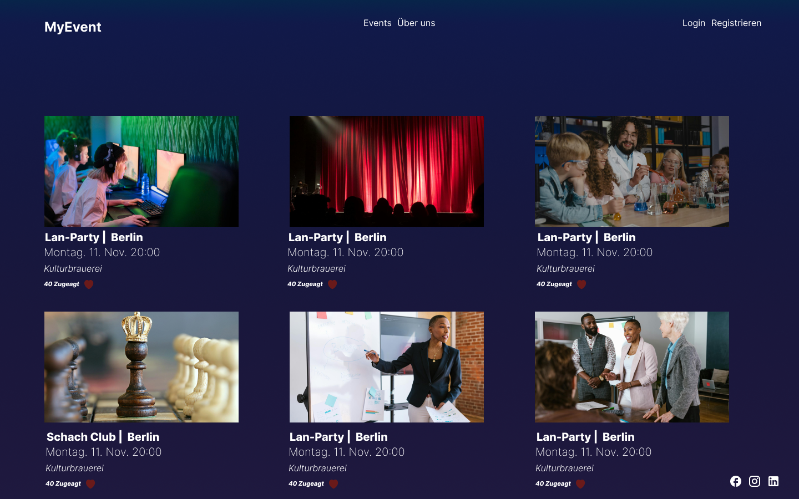
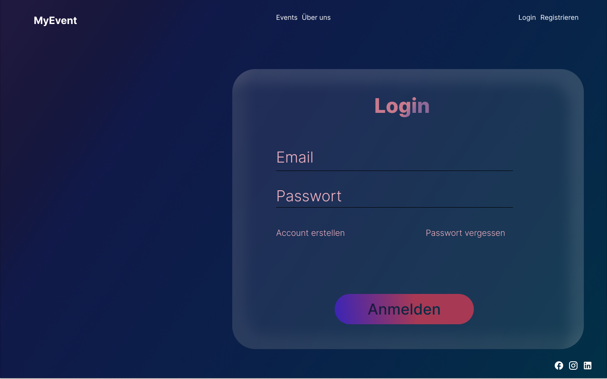
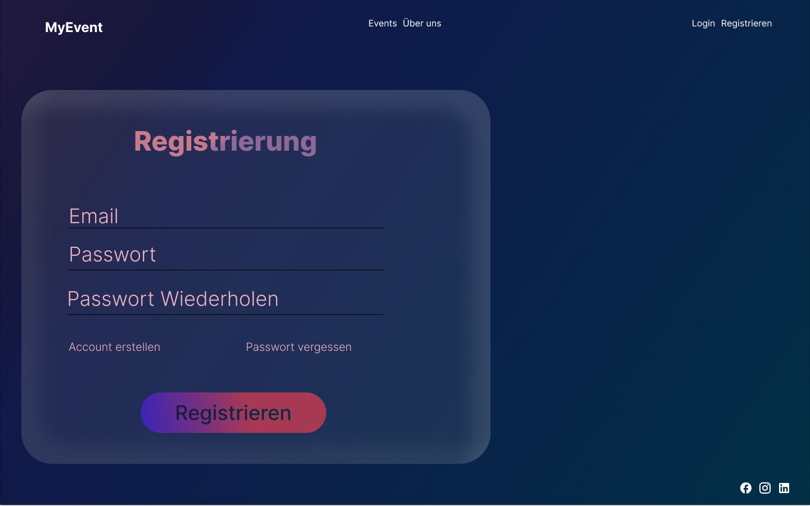
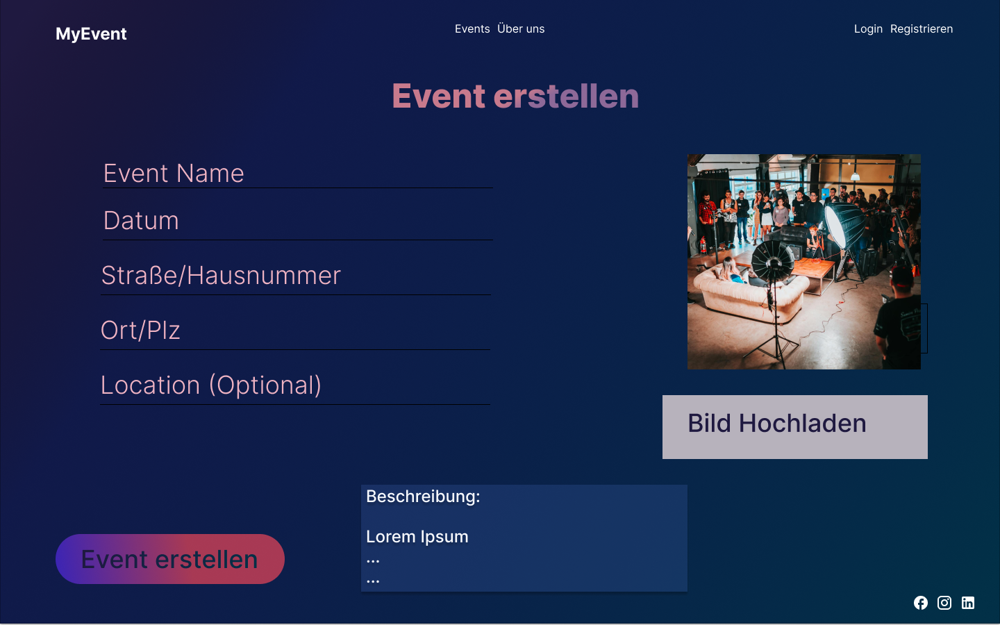
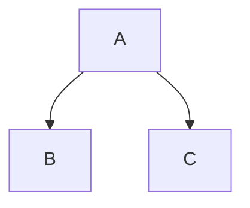

# UI components


In diesem Projekt wurden verschiedene Benutzeroberflächenkomponenten entwickelt, um eine benutzerfreundliche und intuitive Webanwendung zu erstellen. Diese Komponenten umfassen die Hauptseiten der Anwendung, die es Benutzern ermöglichen, sich anzumelden, sich zu registrieren, neue Events zu erstellen und ihre Events im Dashboard anzuzeigen.

{: .info }
> Diese Dokumentation beschreibt die wichtigsten UI-Komponenten, ihre Funktionen und die enthaltenen Elemente.

## 1. Login-Seite (`login.html`)

Die Login-Seite ermöglicht es Benutzern, sich in ihren bestehenden Konten anzumelden.

**Elemente:**  
- **E-Mail-Adresse**: Ein Textfeld für die Eingabe der E-Mail-Adresse.  
- **Passwort**: Ein Passwortfeld für die Eingabe des Passworts.  
- **Einloggen-Button**: Ein Button, der das Formular absendet und den Benutzer anmeldet.

{: .attention }
> Benutzer müssen bereits registriert sein, um sich einloggen zu können.

---

## 2. Registrierungsseite (`register.html`)

Die Registrierungsseite ermöglicht es neuen Benutzern, ein Konto zu erstellen.

**Elemente:**  
- **E-Mail-Adresse**: Ein Textfeld für die Eingabe der E-Mail-Adresse.  
- **Passwort**: Ein Passwortfeld für die Eingabe des Passworts.  
- **Passwort bestätigen**: Ein weiteres Passwortfeld, um das Passwort zu bestätigen.  
- **Registrieren-Button**: Ein Button, der das Formular absendet und das Konto erstellt.

{: .tip }
> Sichere Passwörter werden durch eine Mindestlänge und Sonderzeichen validiert.

---

## 3. Dashboard-Seite (`dashboard.html`)

Das Dashboard ist die Hauptseite, die Benutzer nach dem Login sehen.

**Elemente:**  
- **Willkommensnachricht**: Eine Begrüßungsnachricht für den Benutzer.  
- **Event-Liste**: Eine Liste der Events mit Links zu den Event-Details.  
- **Logout-Button**: Ein Button, der den Benutzer abmeldet.

{: .info }
> Das Dashboard ist nur von eingeloggten Benutzern sichtbar.

---

## 4. Event-Erstellungsseite (`createEvent.html`)

Die Event-Erstellungsseite ermöglicht es Benutzern, neue Events zu erstellen.

**Elemente:**  
- **Name**: Ein Textfeld für den Titel des Events.  
- **Datum**: Ein Datumsfeld für die Eingabe des Eventdatums.  
- **Ort**: Ein Textfeld für die Eingabe des Eventorts.  
- **Eventbild**: Ein Datei-Upload-Feld für das Hochladen eines Eventbildes.  
- **Kategorie**: Ein Dropdown-Menü zur Auswahl der Eventkategorie.  
- **Event erstellen-Button**: Ein Button, der das Formular absendet und das Event erstellt.

**Funktionsbeschreibung:**  
1. **Formularverarbeitung:** Die eingegebenen Daten werden an den Server gesendet.  
2. **Bild-Upload:** Das ausgewählte Bild wird in Firebase Storage hochgeladen.  
3. **Datenbank-Speicherung:** Die Event-Daten werden in Firestore gespeichert.  
4. **Erfolgsmeldung:** Nach erfolgreicher Erstellung wird eine Meldung angezeigt.

{: .attention }
> Benutzer müssen sicherstellen, dass alle Felder ausgefüllt sind, bevor sie das Formular absenden.

---

## 5. Event-Details-Seite (`event_info.html`)

Die Event-Details-Seite zeigt detaillierte Informationen zu einem bestimmten Event an.

**Elemente:**  
- **Event-Titel**: Der Titel des Events.  
- **Event-ID**: Die eindeutige ID des Events.  
- **Datum**: Das Datum des Events.  
- **Ort**: Der Ort des Events.  
- **Kategorie**: Die Kategorie des Events.  
- **Eventbild**: Ein Bild des Events.  
- **RSVP-Button**: Ein Button, um die Teilnahme zu bestätigen.  
- **Zurück zum Dashboard-Link**: Ein Link, der zurück zum Dashboard führt.

{: .info }
> RSVP-Status wird in der Firestore-Datenbank gespeichert.

---

## Visual Representation


## Images
```
Mit Figma designed!
```
Home Page


Login


Registrierung


Eventerstellung



to upload...

## Callouts

{: .info }
> Dashboard und EventInfo Page müssen noch designt werden

{: .tip }
> This is a tip callout.

{: .attention }
> This is an attention callout.

> {: .download }
> This is a download callout.

## Labels

{: .label }
[Default label]

{: .label .label-green }
[Green label]

{: .label .label-red }
[Red label]

## Mermaid.js



Visit the [Mermaid docs](https://mermaid.js.org/intro/) for a thorough description of the charting possibilities.